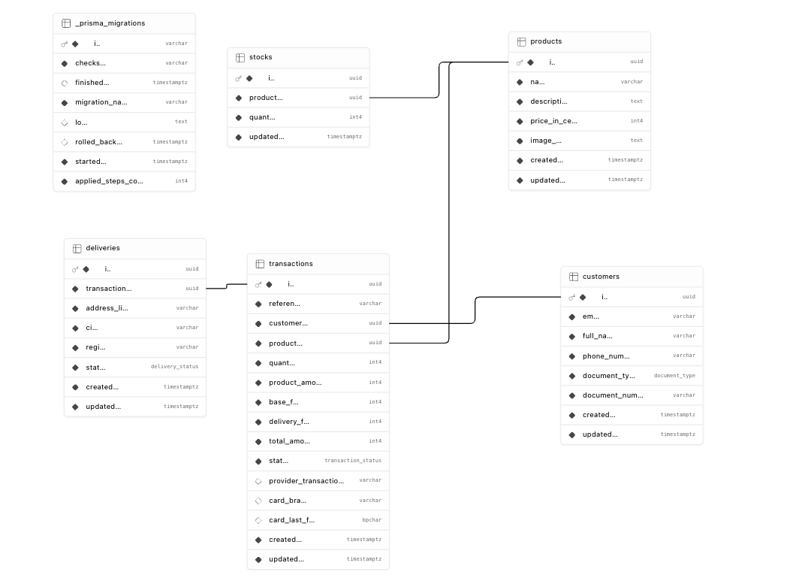
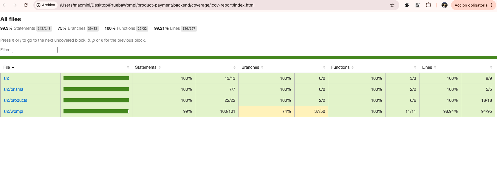
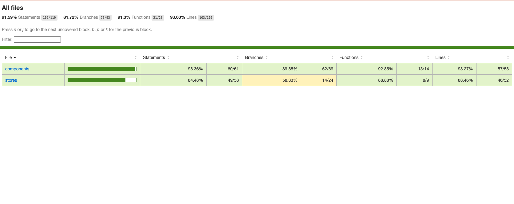

# Lumina - Checkout de Producto con Pasarela de Pagos

Este proyecto ha sido desarrollado como una **Prueba Técnica** profesional. Consiste en una aplicación completa de checkout (compra rápida) de un solo producto, conectada a una pasarela de pagos en modo **Sandbox** (entorno de pruebas). El sistema realiza el cobro seguro con tarjeta, registra la información del cliente y la entrega, y actualiza de manera segura y concurrente el inventario.

---

## 🚀 Enlaces de Producción

Los servicios se encuentran desplegados y conectados en la nube:

*   **Frontend (Vercel):** [https://product-payment-topaz.vercel.app](https://product-payment-topaz.vercel.app)
*   **Backend API (Railway):** [https://product-payment-production.up.railway.app](https://product-payment-production.up.railway.app)
*   **Documentación Interactiva (Swagger):** [https://product-payment-production.up.railway.app/api/docs](https://product-payment-production.up.railway.app/api/docs)

---

## 📋 Flujo de la Aplicación (5 Pantallas)

1.  **Catálogo de Productos:** Vista minimalista que muestra la lista de productos disponibles con su stock real y barra de búsqueda reactiva.
2.  **Detalle del Producto:** Ficha técnica simplificada del artículo seleccionado con visualización del precio real de contado y stock disponible.
3.  **Formulario de Pago y Envío:** Formulario donde el cliente ingresa su información personal (nombre, documento, teléfono), dirección de envío y los datos de la tarjeta de crédito.
4.  **Resumen de Compra:** Desglose exacto de los montos (precio base, tarifa de la pasarela y envío) calculado de forma segura en el backend.
5.  **Estado de Transacción:** Pantalla de resultado final (Aprobado, Declinado o Pendiente) que redirige de vuelta al catálogo con el stock actualizado en tiempo real.

---

## 🛠️ Stack Tecnológico

### Frontend
*   **Framework:** Vue 3 (Composition API) + Vite.
*   **Estilos:** Tailwind CSS (diseño mobile-first y totalmente responsive).
*   **Gestión de Estado:** Pinia.
*   **Cliente HTTP:** Axios (configurado con variables de entorno para producción).
*   **Pruebas Unitarias:** Vitest + Vue Test Utils + JSDOM.

### Backend & Base de Datos
*   **Framework:** NestJS (TypeScript).
*   **Base de Datos:** PostgreSQL alojado en Supabase (con pooler de transacciones en puerto `6543`).
*   **ORM:** Prisma ORM.
*   **Documentación:** Swagger OpenAPI.
*   **Pruebas Unitarias:** Jest.

---

## 🗄️ Modelo de Datos (Diagrama Entidad-Relación)

La base de datos PostgreSQL en Supabase está estructurada para dar soporte al ciclo de vida de la transacción. A continuación se presenta el Diagrama Entidad-Relación del proyecto:

<p align="center">
  
</p>

---

## 📊 Cobertura de Pruebas Unitarias (Unit Testing)

Ambos proyectos cuentan con suites de pruebas unitarias robustas que superan ampliamente el mínimo exigido del 85%:

### Backend (Jest)
*   **Cobertura de Líneas y Sentencias:** **`100%`**
*   **Cobertura de Funciones:** **`100%`**
*   **Archivos testeados:** Controladores, servicios y proveedores de base de datos (`ProductsService`, `ProductsController`, `WompiService`, `WompiController`, `PrismaService`, `AppController`).

<p align="center">
  
</p>

### Frontend (Vitest)
*   **Cobertura de Líneas:** **`93.63%`**
*   **Cobertura de Declaraciones:** **`91.59%`**
*   **Archivos testeados:** Store de Pinia (`checkout.ts`), catálogo de productos (`ProductList.vue`) y ficha de detalle (`ProductDetail.vue`).

<p align="center">
  
</p>

---

## 💻 Ejecución Local del Proyecto

### Requisitos Previos
*   Node.js (versión 18 o superior).
*   Un archivo `.env` configurado tanto en la carpeta `front/` como en `backend/`.

### 1. Levantar el Backend
```bash
# Entrar a la carpeta del backend
cd backend

# Instalar dependencias
npm install

# Ejecutar migraciones de base de datos y cliente Prisma
npx prisma generate
npx prisma migrate dev

# Iniciar servidor en modo desarrollo (http://localhost:3000)
npm run start:dev

# Ejecutar pruebas unitarias con reporte de cobertura
npm run test:cov
```

### 2. Levantar el Frontend
```bash
# Entrar a la carpeta del frontend
cd ../front

# Instalar dependencias
npm install

# Iniciar servidor de desarrollo Vite (http://localhost:5173)
npm run dev

# Ejecutar pruebas unitarias con reporte de cobertura
npm run test:cov
```
